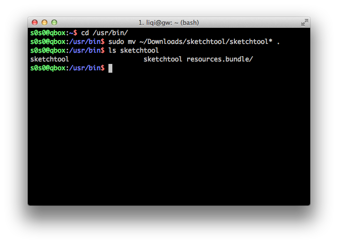
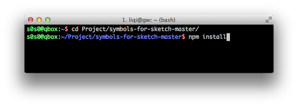
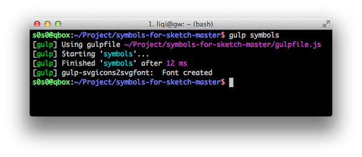
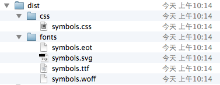

早先使用 Sketch 绘制一些 icon，导出成为 SVG 之后需要前往 [Fontello][1] 等网站生成 font 来使用，偶尔还会出现在不同的网站生成效果也不一样，很是麻烦。最近 Sketch 团队发布了命令行工具 [Sketch Tool][2]，可以使用命令行导出 Artboard，本周 Tsutomu Kawamura 发布了一个从 Sketch 文件自动生成 Webfont 的小工具：[Symbols for Sketch][3]（其中用到 [gulp-iconfont][4]、[gulp-sketch][5]），这个小东西使得我们可以直接从 Sketch 文件中输出 font，本文主要写一下这个东西如何使用。
首先你需要一台 Mac，然后需要 [Sketch 3][6]，如果以上都搞定的话，安装 [Sketch Tool][7]，并把它放到你的 $PATH 中：



然后再安装 [Nodejs][8]，一路下一步，安装完成之后打开任何一个你喜欢的命令行工具执行：

	$ sudo npm install -g gulp


安装完成之后下载[这个文件][9]，解压缩到任何一个你喜欢的目录中，然后通过命令行访问该目录，并执行命令：

	$ npm install



执行完上面的命令之后你会看到这个目录下多了一个叫 node\_modules 的目录，这里面安装了生成 font 必须的程序。至此所有的准备工作就已经完成了，你可以在该目录下看到两个文件：symbol-font-16px.sketch 和 symbol-font-14px.sketch，他们的区别是网格不一样，一个是 16px 一个是 14px。你可以使用这两个模板绘制你需要的 icon，每一个 Artboard 的命名就是生成后 icon 的名字，如果你使用 「uF701-icon\_name」的格式来命名 Airboard，那 font code 的名字将会使用 - 之前的代码

当你绘制完了所有的 icon 后，只需要在该目录下执行：
	$ gulp symbols



执行成功之后会出现一个叫做 dist 的目录，该目录下存放了所有生成出的 font 和 CSS，font 会有 eot、ttf、woff 三种格式和 svg 作为 fullback。



如果你希望做更高级别的订制，可以打开 gulpfile.js 来做更深入的订制。

``` js
var gulp = require("gulp");
var rename = require("gulp-rename");
var sketch = require("gulp-sketch");
var iconfont = require('gulp-iconfont');
var consolidate = require('gulp-consolidate');

var fontName = 'symbols'; // 这里可以设置生成出的 font 的名字

gulp.task('symbols', function(){
	gulp.src("symbol-font-14px.sketch") // 这里可以选择使用哪一个 Sketch 文件
	.pipe(sketch({
		export: 'artboards',
		formats: 'svg'
	}))
	.pipe(iconfont({ fontName: fontName }))
	.on('codepoints', function(codepoints) {
		gulp.src('css/fontawesome-style.css')
		.pipe(consolidate('lodash', {
			glyphs: codepoints,
			fontName: fontName,
			fontPath: '../fonts/', // 设置 font 存放的相对路径
			className: 's' // 设置 Class 名
		}))
		.pipe(rename({ basename:fontName }))
		.pipe(gulp.dest('dist/css/')); // 设置导出的 CSS 路径
	})
	.pipe(gulp.dest('dist/fonts/')); // 设置导出的 font 路径

});
```

p.s. 另外不知道是不是人品问题，早先我用 Sketch 绘制的 icon 在 [Fontello][10] 等网站生成后，在 Windows 下显示永远有问题，但是使用 Illustrator 绘制的生成后就没有问题……还未测试通过这个方式生成会不会存在显示的问题=。=

[1]:	http://fontello.com/ "Fontello"
[2]:	http://bohemiancoding.com/sketch/tool/ "Sketch Tool"
[3]:	https://github.com/cognitom/symbols-for-sketch "Symbol for sketch"
[4]:	https://github.com/nfroidure/gulp-iconfont
[5]:	https://github.com/cognitom/gulp-sketch
[6]:	https://itunes.apple.com/us/app/sketch/id852320343?mt=12 "sketch3"
[7]:	http://bohemiancoding.com/sketch/tool/ "sketh tool"
[8]:	http://nodejs.org/ "node js"
[9]:	https://github.com/cognitom/symbols-for-sketch/archive/master.zip
[10]:	http://fontello.com/